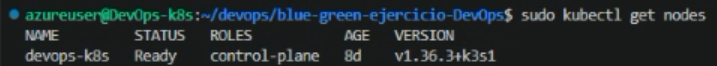
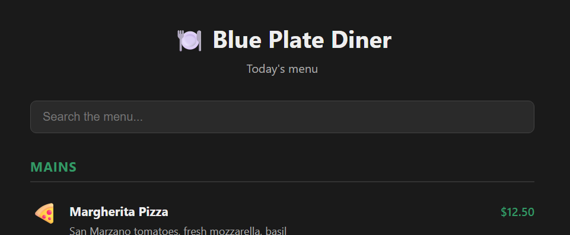
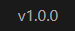
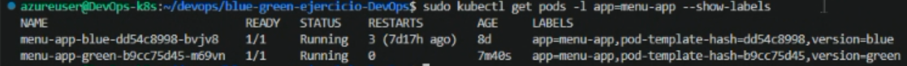
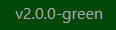
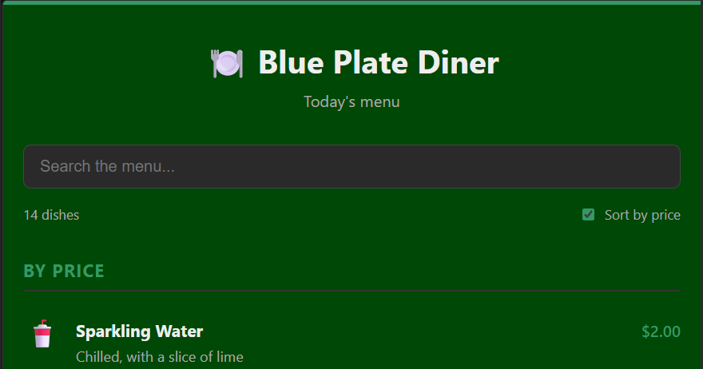

# Entregable 1: Aplicación en Kubernetes

Andrés Christoff - Luis Gaudiano - Sebastián Freire
## Resumen del proyecto

Desplegamos una aplicación web contenerizada en un cluster de Kubernetes, aplicando la estrategia **blue/green** entre dos versiones de la misma app.

La aplicación es **Blue Plate Diner**, construida con **React + Vite**: el menú de un restaurante con precios y una barra de búsqueda que filtra platos por nombre, descripción o categoría. El footer muestra un string de versión, lo que sirve para distinguir a simple vista si estamos viendo *blue* o *green*.

## Stack utilizado

- **Ubuntu (VM):** sistema operativo del servidor.
- **k3s:** distribución liviana de Kubernetes. Trae el cluster completo en un solo binario, junto con su propio runtime de contenedores basado en containerd.
- **Docker:** build de la imagen de la aplicación a partir del Dockerfile.
- **kubectl:** cliente para interactuar con el cluster, se instala junto con k3s.
- **Git:** control de versiones y obtención del código.

Usamos una VM en Azure en vez de correr todo localmente porque las computadoras del grupo no tenían la RAM suficiente para levantar el cluster de forma estable, por eso figura Ubuntu (VM) en el stack en lugar de un sistema operativo local.

Elegimos k3s por sobre alternativas como minikube porque corre directo sobre la VM como servicio del sistema, sin capa de virtualización adicional, consume muchos menos recursos, y es apto para producción y no solo para desarrollo local. El mismo proceso es escalable a un cluster real realizando cambios mínimos.

El aprovisionamiento de esa VM es un paso previo y externo al alcance técnico del curso, así que no se detalla acá: documentamos el proceso a partir de la VM ya disponible y accesible por SSH.

## Proceso de implementación y reproducibilidad

**1. Actualizar el sistema.**

```bash
sudo apt update
sudo apt upgrade
```

**2. Instalar k3s.**

```bash
curl -sfL https://get.k3s.io | sh -
```

Con un solo comando queda corriendo el cluster como servicio del sistema, y `kubectl` instalado automáticamente. Se puede confirmar con `sudo kubectl get nodes`: el nodo tiene que figurar como `Ready`.



**3. Clonar el repositorio.**

```bash
mkdir devops
cd devops
git clone https://github.com/Andychristoff/blue-green-ejercicio-DevOps
cd blue-green-ejercicio-DevOps
```

**4. Instalar Docker**, siguiendo el proceso oficial: agregar el repositorio apt y su clave GPG, e instalar los paquetes.

```bash
sudo apt install -y ca-certificates curl gnupg

sudo install -m 0755 -d /etc/apt/keyrings
curl -fsSL https://download.docker.com/linux/ubuntu/gpg | sudo gpg --dearmor -o /etc/apt/keyrings/docker.gpg
sudo chmod a+r /etc/apt/keyrings/docker.gpg

echo "deb [arch=$(dpkg --print-architecture) signed-by=/etc/apt/keyrings/docker.gpg] https://download.docker.com/linux/ubuntu $(. /etc/os-release && echo "$VERSION_CODENAME") stable" | sudo tee /etc/apt/sources.list.d/docker.list > /dev/null

sudo apt update
sudo apt install -y docker-ce docker-ce-cli containerd.io docker-buildx-plugin docker-compose-plugin
```

Docker se usa únicamente para el build de la imagen. Los contenedores en el cluster los corre el runtime propio de k3s, no el Docker daemon.

**5. Construir la imagen de la versión blue.**

```bash
sudo docker build -t menu-app:v1 .
```

**6. Aplicar los manifiestos de Kubernetes.**

```bash
sudo kubectl apply -f blue.yaml
sudo kubectl apply -f service.yaml
```

`blue.yaml` define el Deployment de la app, y `service.yaml` el Service que la expone y enruta el tráfico hacia los pods.

**7. Problema con el que nos encontramos:** los pods quedan en `ImagePullBackOff` o `ErrImageNeverPull`.

La causa es que k3s no usa el Docker daemon para correr contenedores, sino su propio runtime basado en containerd, y ambos mantienen almacenes de imágenes separados en la misma máquina. Como no se usó ningún registry externo para publicar la imagen, k3s no tenía forma de encontrarla.

**8. La solución:** en vez de levantar un registry, exportamos la imagen de Docker y la importamos directo al containerd de k3s.

```bash
sudo docker save menu-app:v1 -o menu-app.tar
sudo k3s ctr images import menu-app.tar
```

`docker save` empaqueta la imagen en un `.tar`, y `k3s ctr images import` la carga directamente donde k3s la necesita, sin pasar por ningún registry.

**9. Redesplegar y verificar.**

```bash
sudo kubectl delete -f blue.yaml
sudo kubectl apply -f blue.yaml

sudo kubectl get pods
sudo kubectl get svc
```

Borrar y volver a aplicar fuerza a Kubernetes a recrear el pod, que esta vez sí encuentra la imagen. El pod debería figurar como `Running`, y el Service con su IP y puerto asignados.





**10. Preparar la versión green.**

La estrategia blue/green consiste en tener las dos versiones corriendo en paralelo, cada una en su propio Deployment, y usar el Service como único punto de entrada: el `selector` decide a cuál de las dos apunta el tráfico. Antes de construir la nueva imagen, creamos un archivo `.env.produccion` con la variable `VITE_APP_VERSION=2.0.0-green`, que la aplicación muestra en el footer. Así, una vez desplegada, alcanza con mirar la página para saber qué versión está sirviendo el cluster.

**11. Construir e importar la imagen green.**

```bash
sudo docker build -t menu-app:v2 .
sudo docker save menu-app:v2 -o menu-app-2.tar
sudo k3s ctr images import menu-app-2.tar
```

El procedimiento es el mismo que se usó para blue: build, export a `.tar` e import directo al containerd de k3s.

**12. Aplicar el Deployment de green y verificar que conviva con blue.**

```bash
sudo kubectl apply -f green.yaml
sudo kubectl get pods -l app=menu-app --show-labels
```

En este punto quedan corriendo dos Deployments a la vez, blue y green, cada uno con su propio pod. El `--show-labels` permite confirmar que ambos comparten la label `app=menu-app` pero se distinguen por su versión, que es justamente lo que el Service va a usar para elegir a cuál enrutar.



**13. Alternar el tráfico hacia green.**

Modificamos el `selector` dentro de `service.yaml` para que apunte a la versión green y volvimos a aplicarlo:

```bash
sudo kubectl apply -f service.yaml
```

Desde ese momento el Service enruta hacia los pods de green, sin haber tocado ni recreado ningún pod.



**14. Probar el rollback.**

Para confirmar que la estrategia realmente permite volver atrás sin downtime, modificamos otra vez `service.yaml` para apuntar de nuevo a blue y lo aplicamos:

```bash
sudo kubectl apply -f service.yaml
```

El tráfico vuelve a servirse desde blue de inmediato, lo que valida que el mecanismo de switch funciona en los dos sentidos antes de dar la versión green por definitiva.

**15. Ajustar green y desplegar la versión final.**

Con el rollback ya probado, hicimos dos cambios sobre green. El primero, visual: un fondo verde en el CSS, para que la diferencia entre versiones también sea evidente a simple vista y no solo por el texto del footer. El segundo, funcional: agregamos un checkbox **"Sort by price"** que, al tildarlo, ordena los platos del menú por precio de menor a mayor. De esta forma green no solo se distingue por el color sino que incorpora una funcionalidad nueva respecto de blue. Volvimos a construir la imagen, exportarla e importarla:

```bash
sudo docker build -t menu-app:v2 .
sudo docker save menu-app:v2 -o menu-app-2.tar
sudo k3s ctr images import menu-app-2.tar
```

Como la imagen se reimportó con el mismo tag `v2`, el Deployment de green no se entera solo de que hay una versión nueva disponible, así que forzamos la recreación de sus pods:

```bash
sudo kubectl rollout restart deployment menu-app-green
```

Por último, dejamos el `selector` de `service.yaml` apuntando a green y lo aplicamos, quedando esa como la versión servida por el cluster:

```bash
sudo kubectl apply -f service.yaml
```



